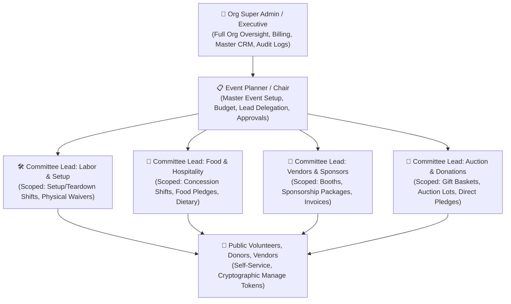

# GatherRaise: Master Product Requirements Document (PRD), Architecture Specification & Technical Blueprint

**Document Version**: 1.0.0  
**Status**: Approved Specification & Architecture Baseline  
**Target Platform**: Multi-Tenant Web Platform (Desktop, Tablet, Mobile)  
**Hosting & Repository**: GitHub with Continuous Integration & Continuous Deployment (CI/CD)

---

## 1. Executive Summary & Problem Definition

### 1.1 Context
Fundraising and volunteer coordination for community organizations (schools, PTAs, non-profits, sports leagues, churches, and civic foundations) is currently fragmented across disparate tools:
- **Volunteer Sign-Ups** (e.g., SignUpGenius): Typically ad-heavy, dated user experience, limited fundraising capability, rigid department structures, and lacking comprehensive compliance/waiver workflows.
- **Fundraising Platforms** (e.g., GoFundMe, DonorsChoose): Focus strictly on monetary donations, detached from day-of-event labor, volunteer shift scheduling, and supply donations.
- **Ticketing & Vendor Apps** (e.g., Eventbrite): Geared toward commercial events, lacks volunteer time tracking, supply pledges, and committee-level delegation.

### 1.2 The GatherRaise Solution
GatherRaise unifies **Volunteer Scheduling**, **Supply Item Pledging**, **Multi-Stream Fundraising** (Donations, Ticket Sales, Silent Auctions, Vendor Booth Fees, and Corporate Sponsorships), **Legal Compliance / Digital Waivers**, **Automated Logistics Communications**, and **Day-of-Event Check-In Operations** into a single, cohesive, enterprise-ready platform.

---

## 2. Core Functional Requirements & Domain Specifications

### 2.1 Multi-Tenant Organization Memory & Management
* **Organization Tenancy**: Every event, user, volunteer, and financial transaction strictly belongs to an `Organization`.
* **Cross-Event Memory (Volunteer CRM)**:
  - Permanent volunteer and donor directory maintained across historical events.
  - Tracks lifetime volunteer hours, total funds donated, past event attendance, reliability rating (attendance vs no-show), and skills/certifications (e.g., *First Aid, Forklift Certified, Food Safety, VIP Donor*).
  - One-click smart re-invitation workflows (e.g., *"Invite all 45 volunteers from the 2025 Gala"*).
* **Organization Setup Templates**:
  - **School / PTA / Booster Club**: Pre-configured with Carnival, Book Fair, Bake Sale, Field Day, and standard minor consent waivers.
  - **Non-Profit / Charity Foundation**: Pre-configured with Annual Gala, 5K Fun Run, Silent Auction, and 501(c)(3) tax receipt templates.
  - **Youth Sports League / Club**: Pre-configured with Concession Stand, Field Setup, Referee Logistics, and Minor Safety agreements.
  - **Church / Faith Community**: Pre-configured with Food Pantry, Holiday Drives, and Fellowship programs.
  - **Corporate Giving & Volunteering**: Pre-configured with Community Service Days and Matching Gift Drives.

---

### 2.2 Role-Based Access Control (RBAC) & Scoped Permissions



#### Detailed Permission Rules:
1. **Org Super Admin / Executive**:
   - Organization settings, branding, EIN/Tax ID, Stripe/payment credentials, user role assignments.
   - Cross-event executive dashboard, organizational financial ledger, 5-year volunteer/donor CRM.
   - Access to immutable security audit logs.
2. **Event Planner / Chairperson**:
   - Master event creation, scheduling, venue location/maps, cover branding, overall fundraising target.
   - Partition event into Sub-Parts (Committees), assign Committee Leads, allocate department budgets.
   - Set variable approval thresholds for department leads.
   - 1-click Approval Queue for lead requests exceeding thresholds.
   - Master roster management and overall event publishing.
3. **Committee / Sub-Part Leads**:
   - Strictly scoped to their assigned department (e.g. *Labor & Setup*, *Food & Hospitality*, *Vendors & Sponsors*, *Silent Auction*).
   - Create, edit, and manage volunteer shifts, headcounts, skill requirements, and item wishlists for their department.
   - Track department-specific budget and expenditures.
   - Broadcast targeted announcements and reminders strictly to their department's volunteers.
   - Station-level volunteer check-in and QR code scanning.
   - *Cannot alter global event settings, budgets of other departments, or access other leads' private data.*
4. **Vendors & Corporate Sponsors**:
   - Browse booth packages and sponsorship tiers.
   - Submit business intake data (Business Name, EIN, space dimensions, power needs, Certificate of Insurance).
   - Pay via instant credit/debit card, Apple Pay, PayPal, or request a corporate invoice (Net-15/30 terms).
   - Access official 501(c)(3) tax deduction receipts and view booth assignments (*Booth #A-14*).
5. **Volunteers, Donors & Attendees**:
   - Browse public event pages with zero account creation friction.
   - Claim volunteer shifts, register family members/children, pledge supply items, purchase tickets, and donate.
   - Secure self-service management via 256-bit cryptographic manage tokens.
   - Access digital check-in passes, `.ics` calendar sync, and automated shift reminders.

---

### 2.3 Event Sub-Parts (Committees) & Variable Approval Workflow
* **Modular Department Partitioning**: An event can contain multiple sub-parts (e.g., *Labor & Setup, Food & Hospitality, Vendors & Marketplace, Silent Auction, Registration & Greeters*).
* **Variable Approval Thresholds**:
  - Configurable by the Event Planner (e.g., `Budget Increase Threshold: $250`, `Shift Slot Additions Threshold: 5 spots`).
  - **Within Threshold**: Lead changes are instantly approved and published live.
  - **Exceeding Threshold**: Lead changes enter the Event Planner's **1-Click Approval Queue** (`Pending_Approval`), sending a notification to the Planner with Approve / Reject / Edit options.

---

### 2.4 Turnkey Event Setup Templates
1. **Charity Gala & Silent Auction** ($25,000 Goal): VIP Registration, Silent Auction Baskets, Hospitality/Bar, Table Sponsorships ($5,000 Presenting, $1,500 Table, $250 Individual).
2. **Community 5K Fun Run & Food Drive** ($10,000 Goal): Course Marshals, Water Stations, Bib Pickup, Food Drive Collection ($2,500 Title Sponsor, $500 Mile Sponsor, $35 Runner, 50 Canned Food Categories).
3. **School Fall Carnival & Bake Sale** ($5,000 Goal): Game Booth Attendants, Bake Sale / Concessions, Ticket Cashiers, Cleanup Crew ($1,000 Family Sponsor, $20 Unlimited Wristband, 30 Baked Goods Slots).
4. **Youth Sports Tournament & Concession** ($3,500 Goal): Field Lining, Concession Stand Grilling, Scorekeeping/Refs, Food Truck Pitches ($500 Banner Sponsor, $150 Food Truck Space).
5. **Charity Golf Classic & Luncheon** ($20,000 Goal): Hole Contests, Swag Distribution, Beverage Carts, Awards Banquet ($3,000 Hole-in-One, $1,000 Foursome).
6. **Holiday Food & Toy Drive** ($7,500 Goal): Drop-off Unloaders, Gift Sorters, Distribution Guides ($500 Holiday Miracle Sponsor, 50 Toy Categories).
7. **Blank Custom Canvas**: Clean canvas to build custom departments, shifts, items, and financial tiers.

---

### 2.5 Volunteer Sign-Up, Family Registrations & Scheduling Rules
* **Frictionless Unified Sign-Up**: In a single submission card, a participant can claim a volunteer shift, pledge 2 supply items, and make a $50 monetary donation.
* **Family & Group Registrations**:
  - One primary contact (e.g. Parent) can register family members, children, or group volunteers.
  - Captures individual names, ages/grades, emergency contact details, dietary notes, and relationships.
* **Overlap & Conflict Prevention**:
  - Real-time validation checks volunteer name/email against existing bookings for overlapping time windows.
  - Displays clear error: *"Conflict detected: You are already scheduled for 'Morning Setup' (8:00 AM - 10:00 AM)."*
* **Automated Waitlists**:
  - When a shift hits capacity (e.g. 5/5 spots filled), a responsive *"Join Waitlist"* button appears.
  - If a confirmed volunteer cancels, the #1 waitlisted person is automatically promoted with an instant confirmation notification.

---

### 2.6 Legal Waivers & Compliance Workflow
* **Waiver Templates**:
  - Minor Safety & Parental Consent (with parent/guardian declaration).
  - General Liability & Physical Labor Release.
  - Food Safety & Handling Certification Acknowledgement.
  - Photo / Media Release.
* **Digital Signature Engine**:
  - Vector-based touch/mouse signature pad + typed legal name option.
  - Captures legal timestamp, signer IP address, relationship declaration for minors, and legal disclaimer text.
* **Pre-Event & At-Door Compliance Enforcement**:
  - Visual badge on organizer rosters (🟢 *Waiver Signed* vs 🔴 *Waiver Pending*).
  - Automated pre-event reminder emails reminding unsigned volunteers to sign online.
  - **On-Site Door Enforcement**: If a volunteer arrives without a signed waiver, the check-in tablet kiosk prompts for signature before completing check-in.

---

### 2.7 Multi-Stream Fundraising, Payments & Invoicing
* **Payment Gateways Supported**:
  - Credit & Debit Cards (Stripe tokenized checkout).
  - PayPal & Digital Wallets (Apple Pay, Google Pay).
  - Corporate Invoices (Net-15 / Net-30 payment terms with downloadable PDF).
  - Offline Cash / Check pledge recording by organizers.
* **Processing Fee Handling**:
  - Optional *"Cover 2.9% + $0.30 payment processing fee"* toggle so 100% of the funds reach the organization.
* **Automated 501(c)(3) Tax-Deductible Receipts**:
  - Generates official tax acknowledgement receipts containing Organization Legal Name, EIN, contribution date, tax-deductible amount, and fair market value offsets.

---

### 2.8 Volunteer Communication & Automated Reminder Engine
* **Instant Booking Confirmation**:
  - Confirmed shift times, **exact reporting gate/location** (with map link), **designated Committee Lead on duty (Name & Phone/Radio)**, dress code, supplies to bring, personal **QR Check-in Pass**, and **1-click Add to Apple/Google Calendar (.ics)**.
* **Configurable Automated Reminder Cadences**:
  - *Standard*: 72h $\rightarrow$ 24h $\rightarrow$ 2h before shift.
  - *Intensive*: 7d $\rightarrow$ 3d $\rightarrow$ 24h $\rightarrow$ 2h before shift.
  - *Same-Day Express*: 24h $\rightarrow$ 2h before shift.
  - *Custom Cadence*.
* **Department-Only Broadcast Channel**:
  - Committee Leads can dispatch instant SMS/Email/In-App announcements strictly to their department's volunteers.

---

### 2.9 Real-Time Gap Detection & Event Intelligence
* **Critical Shift Deficit Alerts**: Automated warning engine flagging shifts <50% filled within 72h / 24h of start time.
* **Item Shortage Tracker**: Live delta between items requested vs. pledged.
* **No-Show Probability Indicator**: Highlights volunteers who haven't confirmed their 24h reminder or signed required waivers.
* **Budget Burn vs. Cap Monitor**: Visual gauge showing department expenses vs allocated limits.
* **Post-Event Debrief Analytics**: Net funds raised vs goal, department performance breakdown, volunteer fulfillment rate (% attended vs no-show), average donation size, and volunteer survey ratings.

---

### 2.10 Comprehensive 1-Click Export Suite
1. **Print-Ready Formatted Rosters**: Clean, printable PDF/HTML sheets with check-in boxes, emergency contacts, and shift times.
2. **Name Badge & Lanyard Sheet Generator**: Print-ready grid of attendee/volunteer badges with event logo, volunteer name, assigned shift/role, and individual check-in QR code.
3. **IRS 501(c)(3) Donor Contribution Statements**: Official tax acknowledgement letters with organization legal name, EIN, contribution date, tax-deductible amount, and signature line.
4. **Excel / CSV Financial Accounting Ledgers**: Detailed double-entry breakdown with donor names, invoice numbers, gross amounts, fee-coverage, net proceeds, and department tags.

---

### 2.11 Day-of-Event Check-In: All 3 Operational Modes
1. **Mode 1: Self-Service Tablet Kiosk**: Full-screen kiosk at venue entrance for self check-in via phone lookup or QR scan, with integrated on-site waiver signing.
2. **Mode 2: Committee Lead Mobile QR Scanner**: Leads use smartphone camera to scan volunteer QR passes at work stations.
3. **Mode 3: Master Digital Roster**: Searchable list with 1-tap check-in toggle and filter by shift, department, or waiver status.

---

## 3. Recommended Antigravity Skills for this Project

To automate recurring operations, audits, and compliance throughout this project's lifecycle, the following specialized skills are recommended:

### 1. `event-gap-analyzer`
* **Purpose**: Inspects active events, calculates fill percentages, identifies critical shortages, flags no-show risks, and generates draft broadcast messages for unfilled shifts.
* **Usage Trigger**: When an organizer asks *"What are the gaps in the upcoming Gala?"* or during scheduled pre-event health checks.

### 2. `volunteer-waiver-auditor`
* **Purpose**: Performs legal compliance audits across volunteer registrations, verifying that all participants (especially minors with parental consent) have signed valid waivers before shift start.
* **Usage Trigger**: Triggered 24h before events to generate compliance reports and notify unsigned volunteers.

### 3. `tax-receipt-generator`
* **Purpose**: Formats IRS-compliant 501(c)(3) tax acknowledgement letters, calculates fair market value offsets for auction items and sponsor perks, and bundles annual giving statements.
* **Usage Trigger**: When an organizer or donor requests end-of-year tax statements or post-event receipts.

### 4. `reminder-schedule-dispatcher`
* **Purpose**: Evaluates event schedules, verifies configured reminder cadences (72h, 24h, 2h), and generates tailored notification payloads with exact reporting gates, Lead contact info, and QR passes.
* **Usage Trigger**: Scheduled cron/event automation to dispatch simulated or live SMS/Email notifications.

### 5. `vendor-booth-allocator`
* **Purpose**: Evaluates vendor intake applications, validates Certificate of Insurance (COI) submissions, and calculates spatial booth grid assignments (*Booth #A-14, Food Truck Bay #2*).
* **Usage Trigger**: When reviewing vendor applications or generating venue layout maps.

---

## 4. Technical Architecture & Tech Stack

```
Technology Matrix:
├── Frontend: React 18 + TypeScript + Vite + Tailwind CSS + Lucide Icons
├── UI Primitives: Radix UI Headless Components + Tailwind Variants
├── Visual Polish: Canvas Confetti + Theme Color Variables + Framer-inspired Micro-interactions
├── Signatures: Vector-based HTML5 Canvas Signature Pad
├── QR Engine: qrcode.react (Generation) + html5-qrcode (Live Camera Scanner)
├── Export Engine: jsPDF + html2canvas + CSV Parser
├── State & Dual Persistence: LocalStorage / IndexedDB Engine + REST API / WebSocket Live Sync
├── Security: Tenant Isolation (tenant_id), Bcrypt/Argon2id, JWT, RBAC Middleware, Zod Validation
└── CI/CD: GitHub Actions (.github/workflows/ci-cd.yml) -> Vercel/Netlify + Render/Railway
```
