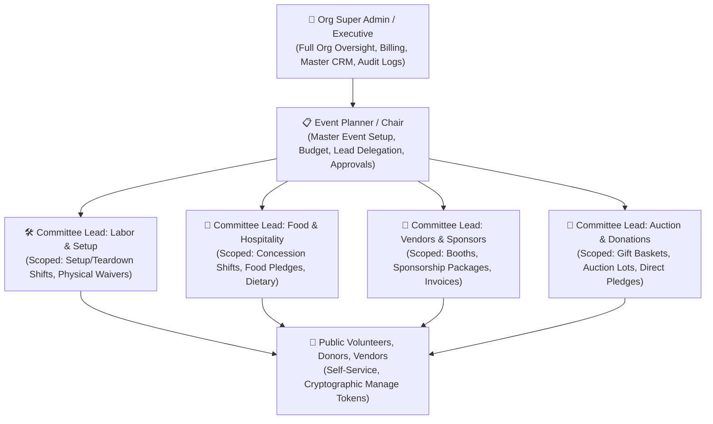

# GatherRaise: Master Product Requirements Document (PRD), Architecture Specification & Technical Blueprint

**Document Version**: 1.2.0  
**Status**: Approved Living Master Architecture & System Specification  
**Target Platform**: Multi-Tenant Web Platform (Desktop, Tablet, Mobile)  
**Hosting & Repository**: GitHub with Continuous Integration & Continuous Deployment (CI/CD)

---

## 1. Executive Summary & Problem Definition

### 1.1 Context
Fundraising and volunteer coordination for community organizations (schools, PTAs, non-profits, sports leagues, churches, and civic foundations) is currently fragmented across disparate tools:
- **Volunteer Sign-Ups** (e.g., SignUpGenius): Typically ad-heavy, dated user experience, limited fundraising capability, rigid department structures, and lacking comprehensive compliance/waiver workflows.
- **Fundraising Platforms** (e.g., GoFundMe, DonorsChoose): Focus strictly on monetary donations, detached from day-of-event labor, volunteer shift scheduling, and supply donations.
- **Ticketing & Vendor Apps** (e.g., Eventbrite): Geared toward commercial events, lacks volunteer time tracking, supply pledges, and committee-level delegation.

### 1.2 The GatherRaise Solution
GatherRaise unifies **Volunteer Scheduling**, **Supply Item Pledging**, **Multi-Stream Fundraising** (Donations, Ticket Sales, Silent Auctions, Vendor Booth Fees, and Corporate Sponsorships), **Legal Compliance / Digital Waivers**, **Automated Logistics Communications**, and **Day-of-Event Check-In Operations** into a single, cohesive, enterprise-ready platform.

---

## 2. Core Functional Requirements & Domain Specifications

### 2.1 Multi-Tenant Organization Memory & Management
* **Organization Tenancy**: Every event, user, volunteer, and financial transaction strictly belongs to an `Organization`.
* **Cross-Event Memory (Volunteer CRM)**:
  - Permanent volunteer and donor directory maintained across historical events.
  - Tracks lifetime volunteer hours, total funds donated, past event attendance, reliability rating (attendance vs no-show), and skills/certifications (e.g., *First Aid, Forklift Certified, Food Safety, VIP Donor*).
  - One-click smart re-invitation workflows (e.g., *"Invite all 45 volunteers from the 2025 Gala"*).
* **Organization Setup Templates**:
  - **School / PTA / Booster Club**: Pre-configured with Carnival, Book Fair, Bake Sale, Field Day, and standard minor consent waivers.
  - **Non-Profit / Charity Foundation**: Pre-configured with Annual Gala, 5K Fun Run, Silent Auction, and 501(c)(3) tax receipt templates.
  - **Youth Sports League / Club**: Pre-configured with Concession Stand, Field Setup, Referee Logistics, and Minor Safety agreements.
  - **Church / Faith Community**: Pre-configured with Food Pantry, Holiday Drives, and Fellowship programs.
  - **Corporate Giving & Volunteering**: Pre-configured with Community Service Days and Matching Gift Drives.

---

### 2.2 Role-Based Access Control (RBAC) & Scoped Permissions



#### Detailed Permission Rules:
1. **Org Super Admin / Executive**:
   - Organization settings, branding, EIN/Tax ID, Stripe/payment credentials, user role assignments.
   - Cross-event executive dashboard, organizational financial ledger, 5-year volunteer/donor CRM.
   - Access to immutable security audit logs.
2. **Event Planner / Chairperson**:
   - Master event creation, scheduling, venue location/maps, cover branding, overall fundraising target.
   - Partition event into Sub-Parts (Committees), assign Committee Leads, allocate department budgets.
   - Set variable approval thresholds for department leads.
   - 1-click Approval Queue for lead requests exceeding thresholds.
   - Master roster management and overall event publishing.
3. **Committee / Sub-Part Leads**:
   - Strictly scoped to their assigned department (e.g. *Labor & Setup*, *Food & Hospitality*, *Vendors & Sponsors*, *Silent Auction*).
   - Create, edit, and manage volunteer shifts, headcounts, skill requirements, and item wishlists for their department.
   - Track department-specific budget and expenditures.
   - Broadcast targeted announcements and reminders strictly to their department's volunteers.
   - Station-level volunteer check-in and QR code scanning.
   - *Cannot alter global event settings, budgets of other departments, or access other leads' private data.*
4. **Vendors & Corporate Sponsors**:
   - Browse booth packages and sponsorship tiers.
   - Submit business intake data (Business Name, EIN, space dimensions, power needs, Certificate of Insurance).
   - Pay via instant credit/debit card, Apple Pay, PayPal, or request a corporate invoice (Net-15/30 terms).
   - Access official 501(c)(3) tax deduction receipts and view booth assignments (*Booth #A-14*).
5. **Volunteers, Donors & Attendees**:
   - Browse public event pages with zero account creation friction.
   - Claim volunteer shifts, register family members/children, pledge supply items, purchase tickets, and donate.
   - Secure self-service management via 256-bit cryptographic manage tokens.
   - Access digital check-in passes, `.ics` calendar sync, and automated shift reminders.

---

### 2.3 Event Sub-Parts (Committees) & Variable Approval Workflow
* **Modular Department Partitioning**: An event can contain multiple sub-parts (e.g., *Labor & Setup, Food & Hospitality, Vendors & Marketplace, Silent Auction, Registration & Greeters*).
* **Variable Approval Thresholds**:
  - Configurable by the Event Planner (e.g., `Budget Increase Threshold: $250`, `Shift Slot Additions Threshold: 5 spots`).
  - **Within Threshold**: Lead changes are instantly approved and published live.
  - **Exceeding Threshold**: Lead changes enter the Event Planner's **1-Click Approval Queue** (`Pending_Approval`), sending a notification to the Planner with Approve / Reject / Edit options.

---

### 2.4 Turnkey Event Setup Templates
1. **Charity Gala & Silent Auction** ($25,000 Goal): VIP Registration, Silent Auction Baskets, Hospitality/Bar, Table Sponsorships ($5,000 Presenting, $1,500 Table, $250 Individual).
2. **Community 5K Fun Run & Food Drive** ($10,000 Goal): Course Marshals, Water Stations, Bib Pickup, Food Drive Collection ($2,500 Title Sponsor, $500 Mile Sponsor, $35 Runner, 50 Canned Food Categories).
3. **School Fall Carnival & Bake Sale** ($5,000 Goal): Game Booth Attendants, Bake Sale / Concessions, Ticket Cashiers, Cleanup Crew ($1,000 Family Sponsor, $20 Unlimited Wristband, 30 Baked Goods Slots).
4. **Youth Sports Tournament & Concession** ($3,500 Goal): Field Lining, Concession Stand Grilling, Scorekeeping/Refs, Food Truck Pitches ($500 Banner Sponsor, $150 Food Truck Space).
5. **Charity Golf Classic & Luncheon** ($20,000 Goal): Hole Contests, Swag Distribution, Beverage Carts, Awards Banquet ($3,000 Hole-in-One, $1,000 Foursome).
6. **Holiday Food & Toy Drive** ($7,500 Goal): Drop-off Unloaders, Gift Sorters, Distribution Guides ($500 Holiday Miracle Sponsor, 50 Toy Categories).
7. **Blank Custom Canvas**: Clean canvas to build custom departments, shifts, items, and financial tiers.

---

### 2.5 Volunteer Sign-Up, Family Registrations & Scheduling Rules
* **Frictionless Unified Sign-Up**: In a single submission card, a participant can claim a volunteer shift, pledge 2 supply items, and make a $50 monetary donation.
* **Family & Group Registrations**:
  - One primary contact (e.g. Parent) can register family members, children, or group volunteers.
  - Captures individual names, ages/grades, emergency contact details, dietary notes, and relationships.
* **Overlap & Conflict Prevention**:
  - Real-time validation checks volunteer name/email against existing bookings for overlapping time windows.
  - Displays clear error: *"Conflict detected: You are already scheduled for 'Morning Setup' (8:00 AM - 10:00 AM)."*
* **Automated Waitlists**:
  - When a shift hits capacity (e.g. 5/5 spots filled), a responsive *"Join Waitlist"* button appears.
  - If a confirmed volunteer cancels, the #1 waitlisted person is automatically promoted with an instant confirmation notification.

---

### 2.6 Legal Waivers & Compliance Workflow
* **Waiver Templates**:
  - Minor Safety & Parental Consent (with parent/guardian declaration).
  - General Liability & Physical Labor Release.
  - Food Safety & Handling Certification Acknowledgement.
  - Photo / Media Release.
* **Digital Signature Engine**:
  - Vector-based touch/mouse signature pad + typed legal name option.
  - Captures legal timestamp, signer IP address, relationship declaration for minors, and legal disclaimer text.
* **Pre-Event & At-Door Compliance Enforcement**:
  - Visual badge on organizer rosters (🟢 *Waiver Signed* vs 🔴 *Waiver Pending*).
  - Automated pre-event reminder emails reminding unsigned volunteers to sign online.
  - **On-Site Door Enforcement**: If a volunteer arrives without a signed waiver, the check-in tablet kiosk prompts for signature before completing check-in.

---

### 2.7 Multi-Stream Fundraising, Payments & Invoicing
* **Payment Gateways Supported**:
  - Credit & Debit Cards (Stripe tokenized checkout).
  - PayPal & Digital Wallets (Apple Pay, Google Pay).
  - Corporate Invoices (Net-15 / Net-30 payment terms with downloadable PDF).
  - Offline Cash / Check pledge recording by organizers.
* **Processing Fee Handling**:
  - Optional *"Cover 2.9% + $0.30 payment processing fee"* toggle so 100% of the funds reach the organization.
* **Automated 501(c)(3) Tax-Deductible Receipts**:
  - Generates official tax acknowledgement receipts containing Organization Legal Name, EIN, contribution date, tax-deductible amount, and fair market value offsets.

---

### 2.8 Volunteer Communication & Automated Reminder Engine
* **Instant Booking Confirmation**:
  - Confirmed shift times, **exact reporting gate/location** (with map link), **designated Committee Lead on duty (Name & Phone/Radio)**, dress code, supplies to bring, personal **QR Check-in Pass**, and **1-click Add to Apple/Google Calendar (.ics)**.
* **Configurable Automated Reminder Cadences**:
  - *Standard*: 72h $\rightarrow$ 24h $\rightarrow$ 2h before shift.
  - *Intensive*: 7d $\rightarrow$ 3d $\rightarrow$ 24h $\rightarrow$ 2h before shift.
  - *Same-Day Express*: 24h $\rightarrow$ 2h before shift.
  - *Custom Cadence*.
* **Department-Only Broadcast Channel**:
  - Committee Leads can dispatch instant SMS/Email/In-App announcements strictly to their department's volunteers.

---

### 2.9 Real-Time Gap Detection & Event Intelligence
* **Critical Shift Deficit Alerts**: Automated warning engine flagging shifts <50% filled within 72h / 24h of start time.
* **Item Shortage Tracker**: Live delta between items requested vs. pledged.
* **No-Show Probability Indicator**: Highlights volunteers who haven't confirmed their 24h reminder or signed required waivers.
* **Budget Burn vs. Cap Monitor**: Visual gauge showing department expenses vs allocated limits.
* **Post-Event Debrief Analytics**: Net funds raised vs goal, department performance breakdown, volunteer fulfillment rate (% attended vs no-show), average donation size, and volunteer survey ratings.

---

### 2.10 Comprehensive 1-Click Export Suite
1. **Print-Ready Formatted Rosters**: Clean, printable PDF/HTML sheets with check-in boxes, emergency contacts, and shift times.
2. **Name Badge & Lanyard Sheet Generator**: Print-ready grid of attendee/volunteer badges with event logo, volunteer name, assigned shift/role, and individual check-in QR code.
3. **IRS 501(c)(3) Donor Contribution Statements**: Official tax acknowledgement letters with organization legal name, EIN, contribution date, tax-deductible amount, and signature line.
4. **Excel / CSV Financial Accounting Ledgers**: Detailed double-entry breakdown with donor names, invoice numbers, gross amounts, fee-coverage, net proceeds, and department tags.

---

### 2.11 Day-of-Event Check-In: All 3 Operational Modes
1. **Mode 1: Self-Service Tablet Kiosk**: Full-screen kiosk at venue entrance for self check-in via phone lookup or QR scan, with integrated on-site waiver signing.
2. **Mode 2: Committee Lead Mobile QR Scanner**: Leads use smartphone camera to scan volunteer QR passes at work stations.
3. **Mode 3: Master Digital Roster**: Searchable list with 1-tap check-in toggle and filter by shift, department, or waiver status.

---

## 3. Recommended Antigravity Skills for this Project

To automate recurring operations, audits, and compliance throughout this project's lifecycle, the following specialized skills are recommended:

### 1. `event-gap-analyzer`
* **Purpose**: Inspects active events, calculates fill percentages, identifies critical shortages, flags no-show risks, and generates draft broadcast messages for unfilled shifts.
* **Usage Trigger**: When an organizer asks *"What are the gaps in the upcoming Gala?"* or during scheduled pre-event health checks.

### 2. `volunteer-waiver-auditor`
* **Purpose**: Performs legal compliance audits across volunteer registrations, verifying that all participants (especially minors with parental consent) have signed valid waivers before shift start.
* **Usage Trigger**: Triggered 24h before events to generate compliance reports and notify unsigned volunteers.

### 3. `tax-receipt-generator`
* **Purpose**: Formats IRS-compliant 501(c)(3) tax acknowledgement letters, calculates fair market value offsets for auction items and sponsor perks, and bundles annual giving statements.
* **Usage Trigger**: When an organizer or donor requests end-of-year tax statements or post-event receipts.

### 4. `reminder-schedule-dispatcher`
* **Purpose**: Evaluates event schedules, verifies configured reminder cadences (72h, 24h, 2h), and generates tailored notification payloads with exact reporting gates, Lead contact info, and QR passes.
* **Usage Trigger**: Scheduled cron/event automation to dispatch simulated or live SMS/Email notifications.

### 5. `vendor-booth-allocator`
* **Purpose**: Evaluates vendor intake applications, validates Certificate of Insurance (COI) submissions, and calculates spatial booth grid assignments (*Booth #A-14, Food Truck Bay #2*).
* **Usage Trigger**: When reviewing vendor applications or generating venue layout maps.

---

## 4. Technical Architecture & Tech Stack

```
Technology Matrix:
├── Frontend: React 18 + TypeScript + Vite + Tailwind CSS + Lucide Icons
├── UI Primitives: Radix UI Headless Components + Tailwind Variants
├── Visual Polish: Canvas Confetti + Theme Color Variables + Framer-inspired Micro-interactions
├── Signatures: Vector-based HTML5 Canvas Signature Pad (DPR-normalized 1:1 precision)
├── QR Engine: qrcode.react (Generation) + html5-qrcode (Live Camera Scanner)
├── Export Engine: jsPDF + html2canvas + CSV Parser
├── State & Dual Persistence: LocalStorage / IndexedDB Engine + REST API / WebSocket Live Sync
├── Email & Dispatch: Resend API (React Email), Postmark, AWS SES, Custom Domain DKIM/SPF CNAMEs
├── SMS Roadmap: Twilio / Telnyx A2P 10DLC Non-Profit ISV Campaign Registration & T-72h/24h/2h alerts
├── Security: Tenant Isolation (org_id), Bcrypt/Argon2id, JWT, RBAC Middleware, Zod Validation
└── CI/CD: GitHub Actions (.github/workflows/ci-cd.yml) -> Vercel/Netlify + Render/Railway
```

---

## 5. Recent Platform Extensions & Functional Modules

### 5.1 7-Step Interactive Guided Event Builder Wizard (`EventBuilderWizard.tsx`)
1. **Step 1: Source Strategy & Blueprints**: Toggle Industry Blueprints, Clone Past Event, or Blank Canvas.
2. **Step 2: Campaign Essentials & Schedule**: Title, Tagline, Target Goal ($), Start/End Datetime, Venue & Address, Cover Image.
3. **Step 3: Committee Departments & Leadership Assignments**: Dynamic department creation, designated Lead assignments from staff with phone/email, allocated department budgets, radio channels, and reporting gates.
4. **Step 4: Volunteer Shift Needs & Staffing Capacities**: Roles, shift hours, capacity spots, and liability waiver requirements.
5. **Step 5: Supply & Equipment Wishlist Drop-Offs**: Physical items, quantities, units, drop-off stations, deadlines, and IRS Fair Market Value (FMV) offsets.
6. **Step 6: Sponsorship Packages & Commercial Tiers**: Corporate underwriting packages, vendor booths (with footprint dimensions & electricity), admission tickets, and custom perk inclusions.
7. **Step 7: Discovery Tags, Variable Approval Rules & Review**: Curated/custom tags, auto-approval thresholds, dossier review, and 1-click launch.

### 5.2 Email & SMS Dispatch Studio (`OrgExecutiveDashboard.tsx`)
* **Email API Engine**: Configure Resend API keys, Postmark, AWS SES, or Managed Cloud pool.
* **Custom Domain DKIM/SPF Verification**: Automated CNAME DNS inspection (`resend._domainkey.domain.com` -> `dkim.resend.com`).
* **Live Test Dispatch Sandbox**: Real-time test email dispatcher verifying $<2\text{s}$ SLA latency.
* **SMS Gateway Roadmap Backlog**: Formalized A2P 10DLC ISV campaign registration, automated 72h/24h/2h mobile boarding pass SMS, emergency gate alerts, and 6-digit SMS OTP logins.

### 5.4 Volunteer "Build Your Day" Visual Schedule Timeline Bar (`VisualScheduleTimelineBar.tsx`)
* **Docked Interactive Intelligence**: Dynamically surfaces a responsive timeline bar when $\ge 1$ volunteer shift, wishlist supply item, admission ticket, or donation is selected.
* **Chronological Sorting & Labor Economic Metrics**: Automatically sorts selected shifts by start time and computes cumulative volunteer hours (e.g. `5.0 hrs of community impact`).
* **Zero-Conflict Overlap Engine**: Real-time validation checks for temporal overlap across all selected shifts (`startA < endB && endA > startB`).
  * Flags conflicting pairs with detailed minutes overlap warnings (e.g. `⚠️ Time Overlap Conflict: Setup Crew and Face Painting overlap by 30 minutes`).
  * Displays `✓ Zero Conflicts` when all shift timeframes are disjoint.
* **Transit & Rest Buffer Intelligence**: Dynamically computes break intervals between adjacent consecutive shifts (e.g. `⏱️ 30m break`, `⚡ Back-to-back shift`).
* **1-Click Modal Launch**: Direct `✕` removal buttons on individual shift pills and 1-click `Complete Sign-Up & Claim Passes` CTA launching the pre-loaded `UnifiedRegistrationModal`.

### 5.5 1-Click Multi-Channel Campaign Launch Kit & Promotional Suite (`EventMarketingHub.tsx`)
* **Printable 8.5x11 PDF Gate Posters & Tear-Off Flyers**:
  * Letter layout with organization branding, verified 501(c)(3) badge, event schedule, venue address, and urgent open volunteer shift needs.
  * 8 detachable bottom tear-off tabs with mini QR codes and shortlinks for bulletin board posting.
  * 1-click `🖨️ Print / Save 8.5x11 PDF Flyer` triggering print stylesheet.
* **Pre-Written Email & Newsletter Recruitment Blasts**:
  * Ready-to-use launch callout, T-7 days shift shortage drive, and sponsor pitch with 1-click `📋 Copy Subject & Body`.
* **Social Media & Messaging Share Pack**:
  * Formatted copy, emojis, and hashtags for Instagram, Facebook, Nextdoor, LinkedIn, and WhatsApp / SMS Broadcasts.
* **Website Embed & High-Res QR Pack**:
  * Responsive HTML iframe embed snippet + high-resolution downloadable QR code in organization brand colors.
* **Volunteer CRM Pool Re-Engagement Blast**:
  * 1-click targeted broadcast to past volunteer database.

### 5.6 Organization Legal Identity, Defaults & Governance Hub (`OrgExecutiveDashboard.tsx`, `AppContext.tsx`)
* **Legal Entity & Tax Classification**:
  * Full authoring and live synchronization of Legal Organization Name, Tax EIN (Tax ID), Organization Type (`school_pta`, `non_profit`, `youth_sports`, `church_faith`, `corporate_giving`, `other`), and Default Currency (USD, CAD, EUR, GBP).
* **Default Campaign Governance & Variable Approvals**:
  * Organization-wide default budget threshold limit (\$) and shift spots limit for Lead auto-approval vs Planner queue escalation.
  * Default reminder notification cadence configuration (*Standard 72h/24h/2h, Intensive 7d/72h/24h/2h, Same-Day Urgent, Custom*).
* **Team Leadership Contact Attributes**:
  * Author and edit Full Legal Name, Direct Email, Mobile Phone, System Role, and Department Lead assignments with real-time state persistence.

### 5.7 Pro-Bono In-Kind Professional Service Ledger (`MasterPlannerDashboard.tsx`, `LeadPortal.tsx`)
* **Professional Services Tracking**:
  * Dedicated ledger for pro-bono commercial services (*Graphic Design, Audio/Visual Engineering, Legal Counsel, Electrical Setup, Photography, Security*).
  * Captures Donor / Company Name, Service Description, Estimated Fair Market Value (FMV), and Assigned Committee Department.
* **1-Click Delivery Verification**:
  * Planners and Department Leads can toggle status between `Pledged / Scheduled` and `✓ Verified Delivered`, automatically calculating in-kind financial contributions for annual 990/CPA reports.

### 5.8 Master Broadcast Announcements Hub (`MasterPlannerDashboard.tsx`)
* **Multi-Channel Dispatch Engine**:
  * Real-time broadcast creation with multi-channel selection (*Email Blast*, *SMS Text*, *Mobile Push*, *Gate Kiosk Notice*).
  * Urgency categorization (*Normal Update*, *Urgent Attention*, *Critical Alert*).
  * Target audience scoping (*All Attendees & Volunteers*, *Lead Chairs & Staff Only*, *Active Shift Volunteers*).
* **Immutable Notification Ledger**:
  * Dispatched broadcasts are rendered in a chronological announcement ledger with status badges, audience tags, and 1-click removal.

### 5.9 Volunteer CRM Historical Service Logging & Outcome Tie-Back (`VolunteerCrm.tsx`, `AppContext.tsx`)
* **Manual Historical Service Entry Modal**:
  * Coordinators can record past event service for volunteers outside active online campaigns:
    * Event / Campaign Title and Historical Event Date.
    * Contributed Service Hours, Roles / Shifts Served, Supplies Donated, and Direct Donations (\$).
    * Event Campaign Outcome (\$ raised for cause) and Authorized Verifying Coordinator Name.
  * Automatically updates the volunteer's lifetime statistics (`lifetimeHours`, `lifetimeDonations`, `eventsParticipated`, `lastActive`) and appends an immutable `VolunteerEventHistory` entry.

### 5.10 Complete Self-Service Pass & Confirmation Card 4-in-1 Parity (`ManageRegistration.tsx`, `ConfirmationCard.tsx`)
* **Full-Spectrum Registration Management**:
  1. **Scheduled Volunteer Shifts**: Displays shift title, start/end timeframe, assigned household member, committee department, reporting gate, lead on duty contact, dress code notes, and real-time check-in status.
  2. **Pledged Wishlist Supplies & Equipment**: Displays item name, promised quantity, drop-off location/gate, deadline, calculated FMV per unit, and received delivery status.
  3. **Admission & Commercial Tickets / Sponsor Packages**: Displays package title, quantity, total price, and assigned booth footprint number.
  4. **Direct Donations & Tax Receipts**: Displays monetary donation amount, 501(c)(3) tax receipt number, and tax deduction eligibility.
* **Calendar & Mobile Check-In Integration**:
  - 1-click `.ics` Apple iCal / Outlook file download and 1-click Google Calendar integration pre-populated with reporting gate and Lead contact info.
  - Express Day-of-Event QR check-in pass and optional 1-tap password setting to claim account and link household family dependents.

---

## 6. Best-of-Breed Production Security, Compliance & Immutability Architecture

GatherRaise enforces an enterprise-grade, defense-in-depth security and compliance posture designed to satisfy **SOC 2 Type II**, **COPPA (Children's Online Privacy Protection Act)**, **HIPAA/FERPA privacy guidelines**, and **IRS 501(c)(3) Statutory Tax Substantiation** standards.

### 6.1 SOC 2 Type II Security & Cryptographic Authentication Controls
* **Timing-Safe OTP Verification (`crypto.timingSafeEqual`)**:
  - All 6-digit passwordless passcodes are verified using constant-time byte buffers (`verifyOtpTimingSafe` in `api/_lib/auth.ts`) to eliminate remote side-channel timing attacks.
* **Stateless HMAC-SHA256 JWT Sessions in Hardened Cookies**:
  - Authenticated sessions issue signed JWTs (`createSessionJwt`) delivered via `HttpOnly`, `Secure`, `SameSite=Strict`, `Path=/` cookies (`setSessionCookie`).
  - Mitigates XSS-based token theft by completely isolating session credentials from client-side JavaScript execution contexts.
* **Distributed Sliding-Window Token-Bucket Rate Limiting (`api/_lib/rateLimiter.ts`)**:
  - Protects public API endpoints from automated credential stuffing, OTP flooding, and DDoS abuse.
  - Returns standard security headers (`X-RateLimit-Limit`, `X-RateLimit-Remaining`, `X-RateLimit-Reset`) and returns HTTP `429 Too Many Requests` on burst violations.
* **Enterprise HTTP Security Headers (`vercel.json`)**:
  - Enforces `Strict-Transport-Security: max-age=63072000; includeSubDomains; preload` (HSTS).
  - Enforces `X-Frame-Options: DENY` (Anti-Clickjacking).
  - Enforces `X-Content-Type-Options: nosniff` (MIME sniffing protection).
  - Enforces `Content-Security-Policy` restricting script, connect, and style sources.

### 6.2 COPPA & Minor Participant PII Protection
* **Household Mental Model & Zero Minor PII Disclosure**:
  - Volunteers under the age of 18 or 13 are registered as dependent **Household Members** attached to an adult parent/guardian's primary account.
  - Minors are never prompted for direct phone numbers, email addresses, or separate passwords, ensuring strict COPPA compliance.
* **Digital Parental Co-Signing & Vector Stroke Ledger**:
  - For youth volunteers, the platform mandates parental co-signature (`waiverSignatures`) before active check-in passes are unlocked.
  - Stores immutable vector canvas stroke data, parent legal name, timestamp, and IP address for full insurance underwriter defensibility.

### 6.3 IRS 501(c)(3) Statutory Tax Substantiation & Immutability
* **PostgreSQL Immutability Trigger (`prevent_immutable_tax_receipt_tampering`)**:
  - Enforces database-level immutability on `donations` and `tax_receipts` tables.
  - Any SQL `UPDATE` or `DELETE` statement attempting to alter issued receipt numbers, tax years, or deductibility amounts is aborted with an uncatchable database exception.
* **Fair Market Value (FMV) Offsets & Statutory Disclosures**:
  - Automatically calculates net tax-deductible contributions in full compliance with IRS Publication 526 and 561 (e.g. *\$1,000 Corporate Sponsor Tier minus \$150 FMV dinner perk = \$850 tax-deductible contribution*).

### 6.4 PostgreSQL Row-Level Security (RLS) & Multi-Tenant Data Isolation
* **100% RLS Coverage on Live Neon Database**:
  - All 20 core relational tables (`organizations`, `events`, `sub_parts`, `shifts`, `registrations`, `crm_supporters`, `donations`, `tax_receipts`, etc.) have PostgreSQL Row-Level Security (`ENABLE ROW LEVEL SECURITY`) activated.
  - Database queries are strictly partitioned by `org_id` and verified user session context.

### 6.5 Zero Double-Booking Anti-Collision Scheduling Engine (`src/utils/scheduling.ts`)
* **Mathematical Interval Collision Math**:
  - Strictly validates time intervals using `startA < endB && endA > startB`.
  - Guarantees that an individual volunteer cannot be double-booked across overlapping shifts, while seamlessly permitting separate household members to serve concurrently.

### 6.6 Dual-Mode Hybrid Database Client (`api/_lib/db.ts`, `src/services/apiClient.ts`)
* **Zero-Downtime Live DB & Mock Fallback Parity**:
  - Seamlessly queries the live Neon PostgreSQL database when connection strings are available, while gracefully falling back to validated in-memory mock stores in sandbox or offline preview environments.

### 6.7 A2P 10DLC & TCPA SMS Messaging Compliance Architecture
* **CTIA / TCPA & TCR Campaign Registry Compliance**:
  - Form integration with explicit, non-pre-checked SMS consent checkboxes (`SmsOptInConsentBlock.tsx`).
  - Verbatim carrier disclosures specifying sender brand, message cadence (~3–5 msgs/event), standard rate warnings, and HELP/STOP instructions.
  - Zero Third-Party Sharing Guarantee: Mobile originator opt-in data is quarantined within tenant boundaries and is never sold or shared for marketing purposes.
* **Automated Keyword Handling**:
  - `HELP`: Dispatches immediate support guidance (`support@gatherraise.com`).
  - `STOP` / `UNSUBSCRIBE`: Automatically writes to tenant-scoped suppression ledgers and ceases all further SMS dispatch.

### 6.8 Automated Database Backup, Disaster Recovery & 7-Year Retention Engine
* **Multi-Tier Retention Hierarchy (`docs/DISASTER_RECOVERY_AND_BACKUP_SCHEDULE.md`)**:
  - **Tier 1 (Continuous PITR)**: Neon second-by-second write-ahead log (WAL) archiving for 7–30 day point-in-time rollbacks.
  - **Tier 2 (Daily Snapshot)**: Automated daily exports (`npm run db:backup`) compressed via Gzip with SHA-256 cryptographic integrity checksums stored in SSE-KMS encrypted cloud storage (30-day retention).
  - **Tier 3 (Weekly Consolidated)**: Weekly snapshots retained for 90 days.
  - **Tier 4 (Statutory 7-Year IRS Archive)**: Immutable annual fiscal year-end backups retained for **7 years** to satisfy IRS IRC § 170(f)(8) and Form 990 audit requirements.
* **Recovery SLAs**: Recovery Point Objective (RPO) $\le 5\text{ minutes}$; Recovery Time Objective (RTO) $\le 30\text{ minutes}$.


