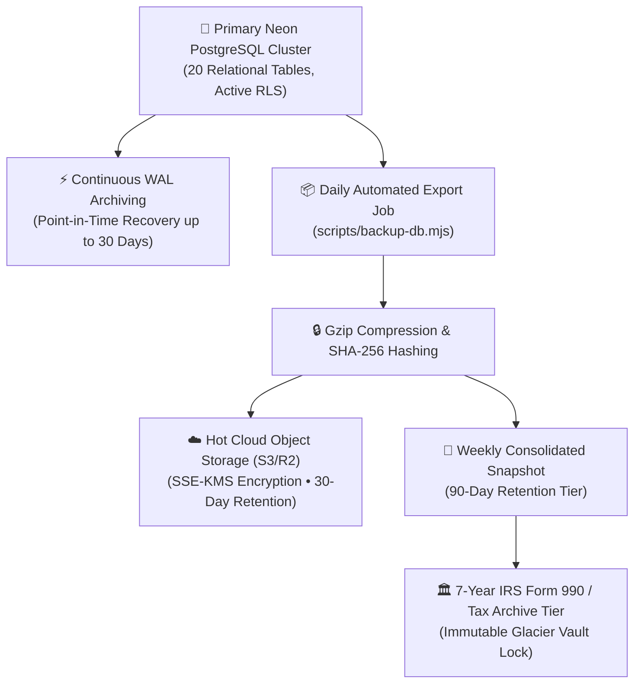

# REACH Disaster Recovery (DR) & Database Backup Schedule

**Document Version**: 2.0.0  
**Effective Date**: September 5, 2026  
**Standards Alignment**: SOC 2 Type II (Availability & Confidentiality Trust Criteria), COPPA Minor Record Isolation, IRS 501(c)(3) Statutory 7-Year Tax Record Retention (IRC § 170(f)(8)).

---

## 1. Objectives & Metrics

| Metric | Target SLA | Description |
| :--- | :--- | :--- |
| **Recovery Point Objective (RPO)** | **$\le$ 5 Minutes** | Maximum acceptable data loss window during catastrophic infrastructure failover. |
| **Recovery Time Objective (RTO)** | **$\le$ 30 Minutes** | Maximum duration required to restore full read/write operations and Row-Level Security policies. |
| **Integrity Assurance** | **SHA-256 Checksums** | Every backup artifact is cryptographically hashed and verified before storage and restoration. |

---

## 2. Multi-Tier Backup Architecture



### 2.1 Tier 1: Continuous Write-Ahead Log (WAL) & Point-In-Time Recovery (PITR)
- **Engine**: Neon PostgreSQL Serverless Continuous WAL streaming.
- **Granularity**: Second-by-second point-in-time recovery.
- **Retention Window**: Active for 7 to 30 days.
- **Use Case**: Instant recovery from accidental bulk record mutation, human administrative error, or immediate transactional failure.

### 2.2 Tier 2: Automated Daily Gzipped Snapshots (`npm run db:backup`)
- **Execution Schedule**: Executed every 24 hours at `02:00 UTC` via serverless cron.
- **Format**: Gzip-compressed SQL payload (`reach_db_backup_YYYY-MM-DD_HHMMSS.sql.gz`).
- **Integrity**: SHA-256 cryptographic checksum generated and recorded in `backups/backup_manifest.json`.
- **Retention**: Retained in hot encrypted cloud storage for **30 days**.

### 2.3 Tier 3: Weekly Consolidated Backups
- **Execution Schedule**: Executed every Sunday at `03:00 UTC`.
- **Retention**: Retained in encrypted cloud storage for **90 days**.

### 2.4 Tier 4: Statutory 7-Year IRS 501(c)(3) Fiscal Year-End Archives
- **Compliance Mandate**: IRS IRC Section 170(f)(8), Form 990 substantiation, and state charitable audit compliance.
- **Scope**: Annual snapshot captured on the final day of the fiscal year (December 31).
- **Storage**: AWS S3 Glacier Vault Lock / Immutable Cloud Storage with strict WORM (Write Once, Read Many) policies preventing deletion for **7 years**.

---

## 3. Disaster Recovery (DR) Execution Runbook

### Step 1: Detect & Assess Incident
If primary database cluster experiences outage or severe corruption:
1. Declare incident and notify Organization Super Admins via emergency status banner.
2. Freeze incoming web traffic with a temporary HTTP 503 Maintenance Response.

### Step 2: Validate Backup Integrity
Execute checksum verification against the latest backup manifest:
```bash
node scripts/restore-db.mjs
```
The script validates that `crypto.createHash('sha256').update(file)` exactly matches `manifest.sha256Checksum`.

### Step 3: Provision / Restore Cluster
1. Point `POSTGRES_URL` to target recovery database instance.
2. Execute migration and restore:
   ```bash
   npm run db:migrate
   node scripts/restore-db.mjs
   ```

### Step 4: Re-Verify Row-Level Security & Triggers
Execute automated database verification to confirm all 20 tables have active RLS policies and IRS immutability triggers:
```bash
npm run db:verify
```

### Step 5: Resume Traffic & Incident Post-Mortem
1. Re-enable edge traffic routing in Vercel.
2. Conduct root-cause analysis (RCA) and file compliance audit log.

---

## 4. Annual Disaster Recovery Drill Protocol
- **Cadence**: Conducted semi-annually in March and September.
- **Procedure**: Test restore to an isolated staging environment and execute full end-to-end browser test suites (`node scratch/test_full_e2e_prod_suite.js`) to verify 0 errors.
