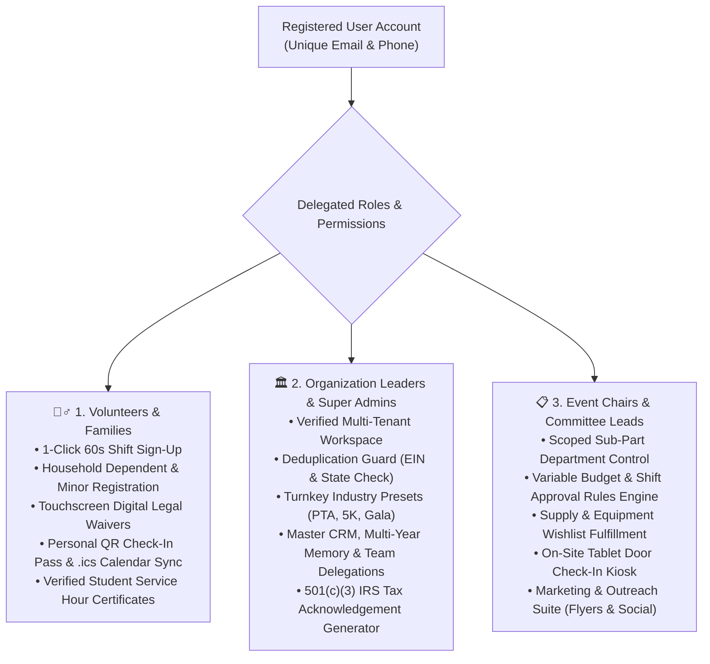
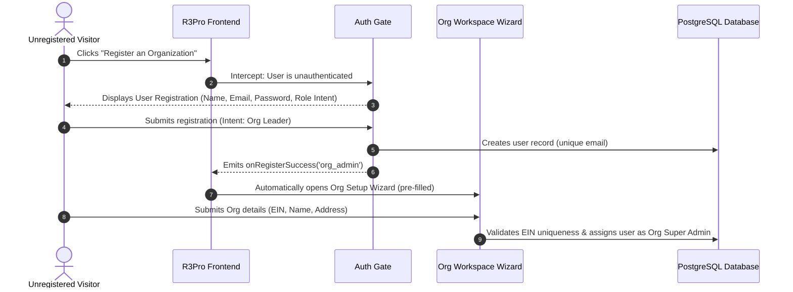
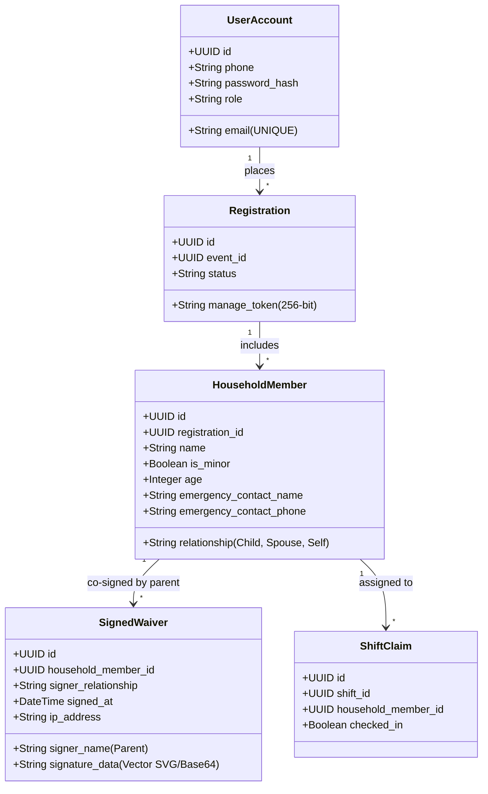

# R3Pro — Master System Architecture, Features & Operational Specifications
**Living Technical & Architectural Specifications Document**
*Last Updated: August 20, 2026*

---

## 1. Executive Overview & Mission
**R3Pro** (*GatherRaise*) is an enterprise-grade multi-tenant community event, volunteer coordination, and fundraising campaign platform engineered for:
1. **501(c)(3) Non-Profit Foundations & Charities**
2. **School PTAs, Booster Clubs & Educational Foundations**
3. **Youth Sports Leagues, Faith Communities & Civic Organizations**

R3Pro solves the chronic operational fragmentation of charity events (paper rosters, disconnected spreadsheets, separate donation platforms, uncoordinated committee leads, and liability waiver compliance risks) by uniting all stakeholders in a cohesive real-time system.

---

## 2. The 3 Core Persona Mental Models & User Experience



### 2.1 Persona 1: Volunteers, Families & Student Service
* **Primary Goal**: Frictionless discovery of local opportunities, rapid sign-up without administrative overhead, family scheduling, and verified student volunteer credit.
* **Key Flows**:
  * **Interactive 7-Column Community Calendar**: Dynamic month navigation with day-specific event chips and 1-click conversion into event details.
  * **Multi-Slot Household Registration**: Single checkout allows claiming shifts for multiple family members.
  * **Digital Legal Waivers**: Mandatory parental co-signature for volunteers under 18.
  * **Personal QR Check-In Pass**: Reusable digital boarding pass with 2-second express scanning at event entry gates.
  * **Verified Service Certificates**: High school service hour tracking with signed verification letters.

### 2.2 Persona 2: Organization Leaders & Super Admins
* **Primary Goal**: Centralized organizational governance, multi-event coordination, permanent volunteer CRM memory, team role delegations, and strict legal/financial compliance.
* **Key Flows**:
  * **Mandatory Registration Gate**: Users must register an authenticated user account before creating an organization.
  * **EIN Deduplication Engine**: Prevents duplicate organization entries across the platform.
  * **Delegated Team Management**: Granular invitations for Event Planners and Committee Leads.
  * **Financial Substantiation**: Official IRS-compliant 501(c)(3) tax acknowledgement letters with FMV offsets.

### 2.3 Persona 3: Event Chairs & Committee Leads
* **Primary Goal**: Flawless on-the-ground event execution, department delegation, shift capacity fulfillment, and on-site check-in.
* **Key Flows**:
  * **Turnkey Setup Templates**: Pre-loads committees, shifts, wishlists, and ticket tiers in 1 click (*Fall Festival, Charity Gala, 5K Fun Run, Sports Tournament*).
  * **Variable Threshold Rules Engine**: Lead modifications within threshold (e.g. $< \$250$ budget or $< 5$ shift spots) auto-approve; larger changes queue for 1-click Event Chair review.
  * **On-Site Tablet Kiosk**: Express door check-in with phone lookup and emergency touch waiver signatures.

---

## 3. Account Lifecycle, Auth Gates & Role Delegation



### 3.1 Role Selection on Signup
When registering, users declare their primary operational intent:
1. **Volunteer & Family**: Immediate redirect to community opportunities and shift sign-ups.
2. **Organization Leader / Coordinator**: Seamless handoff directly into the **Organization Onboarding Wizard**.

### 3.2 Multi-Role Hierarchy Matrix
| Role Level | Permitted Actions | Scoping Boundaries |
| :--- | :--- | :--- |
| **Org Super Admin** | Full organization control, branding, billing, team member invites, audit log, financial reports, all events. | Scoped strictly to assigned `org_id`. |
| **Event Planner / Chair** | Full control over designated events, total budget, variable approval queue, committee setups. | Scoped to assigned `event_id` under `org_id`. |
| **Committee / Sub-Part Lead** | Department shift management, supply wishlist, department broadcast, day-of-event check-in. | Scoped strictly to assigned `sub_part_id`. Cannot mutate global event settings. |
| **Vendor / Sponsor** | Booth package purchases, intake questionnaires (COI, EIN, power requirements), invoice downloads. | Scoped to vendor application records. |
| **Public Volunteer / Donor** | Shift sign-up, family registration, digital waiver signing, ticket purchases, donations, personal QR passes. | Self-service via authenticated account or 256-bit `manage_token`. |

---

## 4. Data Integrity & Deduplication Architecture

### 4.1 Organization Deduplication Engine
* **Normalized EIN Uniqueness**: All EIN inputs are normalized to raw alphanumeric strings (`regexp_replace(ein, '[^0-9]', '', 'g')`).
* **Database Unique Index**:
  ```sql
  CREATE UNIQUE INDEX idx_orgs_ein_unique ON organizations (regexp_replace(ein, '[^0-9]', '', 'g'));
  ```
* **Collision Handling**: If a user attempts to register an existing EIN, the system halts creation and notifies the user of the registered organization name, guiding them to request an invitation from the Org Super Admin.

### 4.2 Event Recurrence & Anti-Collision Engine
* **Annual Recurrences Supported**: Organizations can host recurring annual events (*Lincoln High Fall Carnival 2026* vs *Lincoln High Fall Carnival 2027*).
* **Same-Date Collision Prevention**: Enforces uniqueness on `org_id` + `normalized_title` + `event_date` to prevent accidental duplicate launches for the same operational window.
* **Database Unique Constraint**:
  ```sql
  CREATE UNIQUE INDEX idx_events_org_slug_unique ON events (org_id, slug);
  ```

---

## 5. Household, Minor & Family Multi-Slot Mental Model



### 5.1 Primary Account vs Minor Dependents
1. **Primary Adult Account**:
   * Identified by unique **`email`**.
   * Holds primary login credentials, billing payment methods, and emergency mobile phone number.
2. **Household Dependents & Minors**:
   * Modeled as `HouseholdMember` entities tied to the primary registration.
   * Minors can share parent contact info or leave email/phone blank without failing validation.
   * Each family member receives individual shift slot assignments (e.g. *"Lucas (Son, Age 14) - Obstacle Course Marshall"*).

### 5.2 Legal Compliance & Parental Co-Signing
* **Mandatory Minor Consent**: Any volunteer under 18 claiming a waiver-required shift triggers mandatory parental consent.
* **Audit Trail Captured**:
  * Parent / Legal Guardian Full Legal Name
  * Verified Relationship (*Mother, Father, Legal Guardian*)
  * Digital Signature Vector Stroke Data (Touchscreen / Mouse)
  * Cryptographic Timestamp & Signer IP Address

---

## 6. Operational Features & Built-in Tooling

### 6.1 Interactive 7-Column Month Calendar (`CommunityCalendarView.tsx`)
* Real 7-day grid (`SUN` through `SAT`) dynamically calculating month days and leading offsets.
* Strict date matching ensuring September events only display in September, and October events in October.
* Direct 1-click event pill chips opening the full event volunteer showcase.

### 6.2 Variable Approval Rules Engine (`ApprovalRequestsQueue.tsx`)
* Event Planners define budget thresholds ($X) and shift thresholds (Y spots).
* Lead changes within thresholds are auto-approved.
* Lead changes exceeding thresholds enter the `pending` queue for 1-click Event Chair review.

### 6.3 Event Marketing & Outreach Suite (`EventMarketingHub.tsx`)
* **Social Media Copy Generator**: Tailored post copy with live event stats for Facebook, Instagram, NextDoor, and LinkedIn.
* **Printable 8.5x11 Event Poster**: High-resolution flyer with embedded QR code for bulletin boards and store windows.
* **Embeddable Website Widget**: 1-line HTML `<iframe>` snippet for school and non-profit websites.
* **Volunteer Pool Blast**: Re-engagement email composer to broadcast upcoming opportunities to previous event volunteers.

### 6.4 Reports & IRS Substantiation Center (`ReportsExportCenter.tsx`)
* **Volunteer Check-In Manifest**: Printable door roster with emergency contact phone numbers and dietary notes.
* **IRS 501(c)(3) Tax Deduction Receipts**: Formal tax acknowledgement letters with Fair Market Value (FMV) deduction offsets for tickets and auction items.
* **Student Community Service Certificates**: Verified service completion letters signed by event coordinators.

### 6.5 On-Site Tablet Check-In Kiosk (`KioskSelfCheckIn.tsx`)
* Dedicated touchscreen mode for event entrance gates.
* Express 2-second check-in via QR Pass or mobile phone lookup.
* Emergency on-site signature pad for missing minor liability waivers.

---

## 7. Database Transition Roadmap (Vercel Postgres $\rightarrow$ Supabase)
Full PostgreSQL DDL schema with multi-tenant Row Level Security (RLS) policies is detailed in **[`docs/DATABASE_ROADMAP.md`](file:///Users/patchenuchiyama/Library/Mobile%20Documents/com~apple~CloudDocs/R3Pro/docs/DATABASE_ROADMAP.md)**.
