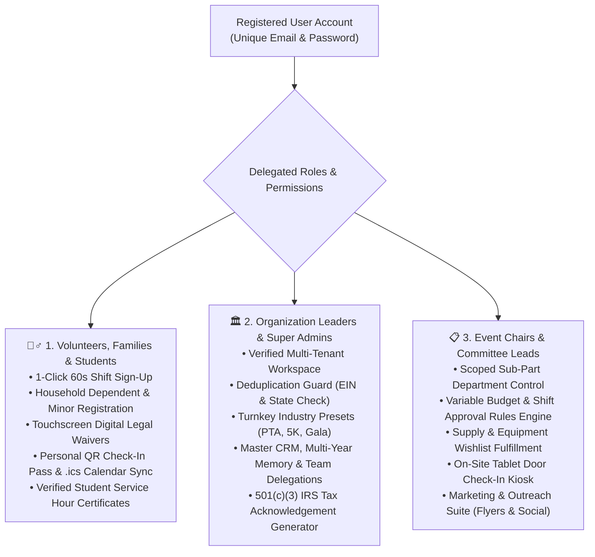
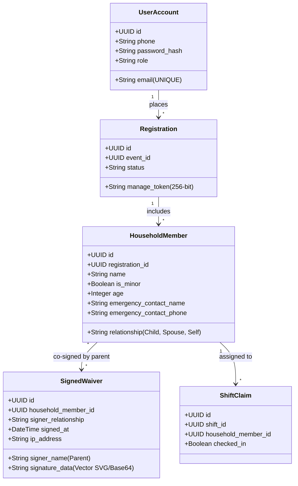

# R3Pro — Master System Architecture, Features & Operational Specifications
**Definitive Living Technical & Architectural Specifications Document**
*Last Comprehensive Audit: August 20, 2026*

---

## 1. System Mission, Vision & Tenancy Model

### 1.1 Mission & Target Market
**R3Pro** (*GatherRaise*) is an enterprise-grade multi-tenant community event, volunteer coordination, and campaign fundraising operating system engineered for:
1. **501(c)(3) Non-Profit Foundations & Charities**
2. **School PTAs, Booster Clubs & Educational Foundations**
3. **Youth Sports Leagues, Faith Communities & Civic Organizations**

R3Pro resolves the operational fragmentation of community events (paper rosters, disconnected spreadsheets, separate donation gateways, uncoordinated committee leads, and liability waiver compliance risks) by uniting all stakeholders in a cohesive real-time system.

### 1.2 Multi-Tenant Isolation & Security
* **Tenant Isolation**: Every database table, API route, and search query strictly scopes data by `org_id` (Organization ID). Cross-tenant data leaks are strictly prohibited.
* **Cryptographic Self-Service**: Public participant self-service links use high-entropy 256-bit cryptographically secure `manage_token` values, allowing volunteers to view their QR passes, edit family member rosters, or cancel shifts without requiring full password logins.
* **Database Row Level Security (RLS)**: Enforced at the PostgreSQL engine level to guarantee that organization admins and committee leads can only query data within their tenant boundaries.

---

## 2. The 3 Core Persona Mental Models & User Experience



### 2.1 Persona 1: Volunteers, Families & Student Service
* **Mental Model**: Frictionless discovery of local opportunities, 60-second sign-up without administrative roadblocks, family scheduling, and verified high school volunteer service credit.
* **Core Workflows**:
  * **Community Event Discovery**: Browsing active campaigns via rich card grids or the authentic 7-column month calendar with strict date matching.
  * **Multi-Slot Household Registration**: Single checkout allows claiming shifts for multiple family members (adults and children).
  * **Digital Legal Waivers**: Touchscreen vector stroke capture with mandatory parental co-signature for minors under 18.
  * **Personal QR Check-In Pass**: Instant digital boarding pass with 2-second express scanning at event entry gates.
  * **Apple & Google Calendar Sync**: 1-click `.ics` calendar file download with exact venue addresses and reporting gate instructions.
  * **Verified Student Service Certificates**: Printable coordinator-signed verification letters for high school and scouting service hours.

### 2.2 Persona 2: Organization Leaders & Super Admins
* **Mental Model**: Centralized organizational governance, multi-event coordination, permanent multi-year volunteer CRM memory, granular role delegations, and strict legal/financial compliance.
* **Core Workflows**:
  * **Mandatory Registration Gate**: Users must register an authenticated user account before creating an organization workspace.
  * **EIN Deduplication Engine**: Alphanumeric Tax ID uniqueness prevents duplicate organization registrations.
  * **Multi-Year Volunteer Memory & CRM**: Historical engagement tracking across all annual campaigns.
  * **Delegated Team Management**: Granular invitations for Event Planners and Committee Leads.
  * **Financial Substantiation**: Automated IRS-compliant 501(c)(3) tax acknowledgement letters with Fair Market Value (FMV) deduction offsets.

#### 2.2.1 Volunteer & Donor CRM Tagging Intelligence & Historical Event Outcome Tie-Back
1. **Automated Behavioral System Tags**:
   * **`Reliable Helper`**: Awarded automatically when a volunteer maintains $\ge 95\%$ on-time attendance across historical events with 0 unexcused no-shows.
   * **`VIP Donor`**: Awarded automatically when cumulative lifetime philanthropic financial contributions exceed the organization threshold ($\ge \$250$).
   * **`Parent Volunteer`**: Awarded automatically when claiming shifts for household dependents/minors or co-signing minor digital waivers.
   * **`Certified First Aid` / `Master Baker` / `STEM Advocate` / `Creative Lead`**: Automatically mapped from verified skill checkboxes and certifications submitted during registration.
   * **`Alumni`**: Tagged when participant indicates past graduation or long-time community tenure.
2. **Historical Event Outcome Tie-Back**:
   * Every volunteer CRM profile contains a complete chronological record of **every event supported** (`eventHistory`).
   * **Impact Ledger Fields**:
     - Event Title & Date.
     - Specific Shifts & Department Roles served (e.g. *Morning Canopy Setup & Sound Rig Tech, 4.5 hrs*).
     - Supplies, equipment, or food items pledged & delivered (e.g. *4 Trays Gluten-Free Fudge Brownies*).
     - Direct financial contributions to that campaign (e.g. *$150.00*).
     - **Tied Campaign Outcome**: Displays the total funds raised and community outcome achieved by that specific event (e.g. *"Event Outcome: Raised $11,450 for Lincoln High STEM Lab"*).
     - Verifying Coordinator on duty.

#### 2.2.2 Master Events Portfolio & Multi-Level Campaign Outcomes Studio
To eliminate fragmentation and provide executive oversight across all historical and active campaigns, the **Org Super Admin Hub** includes the **`🎪 Master Events Portfolio & Outcomes`** studio with 3 dedicated reporting dimensions:
* **Unique Event Keys**:
  - Every campaign is assigned an immutable, human-readable identifier (e.g. `EVT-2026-Q3-001`, `EVT-2026-Q4-002`, `EVT-2025-Q3-001`) based on year, quarter, and sequence.
  - Used for CPA reconciliation, grant audits, and board filings.
* **Dimension 1: By Event (Unique Keys & Deep Dossiers)**:
  - Instant search filter by **Event Key**, campaign title, or venue location.
  - Granular dossier cards displaying cover image, date, financial progress ($ Raised / $ Goal with %), shift capacity fulfillment %, and assigned committee leads.
  - **1-Click Outcome Report Modal**: Displays revenue breakdown (Direct Giving, Tickets, Corporate Sponsors), volunteer labor economic valuation ($31.80/hr statutory rate), and in-kind wishlist fulfillment.
* **Dimension 2: By Quarter (Q1, Q2, Q3, Q4 Rollup)**:
  - Aggregates all campaigns conducted within each fiscal quarter (e.g., *2026 Q3 (Jul - Sep)*).
  - Calculates quarter gross proceeds, direct donations, ticket revenue, corporate sponsors, volunteer service hours, and labor economic valuation.
  - Displays all constituent events with their unique Event Keys.
  - **1-Click Export Actions**: `🖨️ Print Quarterly Summary (PDF)` and `📄 Export Quarter Ledger (CSV)`.
* **Dimension 3: By Calendar Year (Annual Impact & Form 990 Rollup)**:
  - Full annual executive synthesis for Board of Directors and IRS Form 990 filings.
  - Tracks Annual Gross Proceeds, Cumulative Goals, Portfolio Efficiency %, Total Economic Footprint (Funds + Labor Value), and Year-Over-Year (% YoY) revenue growth.
  - Full annual campaign ledger table with Event Keys, Quarters, Dates, and individual outcomes.
  - **1-Click Export Actions**: `🖨️ Print Annual 990 / Board Dossier (PDF)` and `📄 Export Annual Ledger (CSV)`.

### 2.3 Persona 3: Event Chairs & Committee Leads
* **Mental Model**: Flawless on-the-ground event execution, department delegation, shift capacity fulfillment, variable approval governance, and on-site door operations.
* **Core Workflows**:
  * **Turnkey Setup Templates**: Pre-loads committees, shifts, wishlists, and ticket tiers in 1 click (*Fall Festival, Charity Gala, 5K Fun Run, Sports Tournament*).
  * **Variable Threshold Rules Engine**: Lead modifications within threshold (e.g. $< \$250$ budget or $< 5$ shift spots) auto-approve; larger changes queue for 1-click Event Chair review.
  * **Supply & Wishlist Fulfillment**: Item slot pledge tracking with designated drop-off locations and deadlines.
  * **Vendor & Sponsor Marketplace**: Tiered packages with intake questionnaires (Certificate of Insurance upload, EIN, power needs, booth dimensions).
  * **On-Site Tablet Check-In & Day-Of Registration Kiosk**: Express door station featuring dual-mode operations:
    - **`🔍 Mode 1: Check-In (I Already Signed Up Online)`**: Phone/name keypad lookup, 1-tap check-in, on-site emergency touch waiver signing, and reporting gate directions.
    - **`🙋 Mode 2: Day-Of Walk-Up Volunteer Sign-Up ("I Want to Volunteer Day-Of")`**:
      - **Option A (Scan on Phone / Skip The Line)**: Large high-contrast QR code allowing volunteers to self-register on their smartphone in 30 seconds without waiting in line.
      - **Option B (Express Touchscreen Sign-Up)**: 1-minute on-tablet registration allowing walk-up volunteers to choose an open urgent shift, sign the digital safety waiver on screen, and immediately check in.

### 2.4 Modern 2-Tier Navigation Hierarchy & Command Center Architecture
To eliminate cognitive overload and make the role mental model unmistakable, R3Pro utilizes a **2-Tier Header Architecture**:

1. **Top Bar (Persona & Environment Simulator)**:
   * High-contrast gradient banner with **`DEMO SIMULATOR`** yellow badge, active persona chip (*Elena Rostova - Org Super Admin*), bold role pills, sample data reset, and 1-click **`Exit Demo (Live Mode)`**.
2. **Tier 1 (Brand, Entity Context & User Profile)**:
   * Organization selector, active event dropdown, share public link, `+ New Event`, and authenticated user card.
3. **Tier 2 (Primary Workspace Tabs)**:
   * Dedicated, uncompressed workspace navigation bar:

| Navigation Tab / Workspace | URL Route | Permitted Roles | Description & Key Capabilities |
| :--- | :--- | :--- | :--- |
| **Community Events Calendar** | `?tab=discovery_hub` | *All (Public / Authenticated)* | Interactive 7-column month calendar, event cards, progressive CTAs driving volunteer registration. |
| **Event Showcase & Shifts** | `?tab=public_landing` | *All (Public / Authenticated)* | Marketing showcase, 60s volunteer shift registration, item slot drop-offs, ticket checkout, digital waivers. |
| **📊 PLANNER HUB** | `?tab=planner_dashboard` | `org_admin`, `event_planner` | **Unified Campaign Command Center**: Contains sub-tabs for *Committees & Budgets*, *Volunteer Manifest & Check-In*, *Marketing & Flyers*, *Gap Analysis & Health*, *Vendor Marketplace*, and *Reports & Badges*. |
| **Committee Leads Portal** | `?tab=lead_portal` | `org_admin`, `event_planner`, `committee_lead` | Department-scoped lead workspace: shift capacity management, wishlist item tracking, station check-in. |
| **Org Super Admin CRM** | `?tab=org_admin_view` | `org_admin` | Master Events Portfolio & Outcomes, multi-event volunteer CRM, committee lead invitations, audit log. |
| **Door Kiosk Station** | `?tab=kiosk_mode` | `kiosk`, `org_admin`, `event_planner` | Fullscreen tablet kiosk: Dual-mode check-in (Phone/Name lookup) and Day-Of volunteer registration (Scan QR code on phone + on-tablet express sign-up). |


### 2.5 Committee Department & Operational Need Creation Tooling (`MasterPlannerDashboard.tsx`)
Within the **Committees & Budgets** tab of the Planner Hub, Event Chairs and Super Admins have complete operational tools to dynamically partition the event and publish volunteer/supply requirements:
1. **`+ Add Committee Department` Modal**:
   * **Scope & Categorization**: Define operational department name and category (`labor_setup`, `hospitality_food`, `vendors_sponsors`, `auction_fundraising`, `registration_greeters`, `other`).
   * **Lead Delegation**: Assign or specify Lead Coordinator Name, Phone, Email, and Radio Channel for day-of-event dispatch.
   * **Budget Allocation**: Set designated department budget ($) which updates live campaign progress meters.
   * **Logistics & Notes**: Configure designated reporting gates (e.g. *North Gate Desk #1*), dress code requirements, and provided supplies.
2. **`+ Add Volunteer Shift Need` Modal**:
   * Target Committee Department selection.
   * Role Title, description/tasks, start & end date/times, and volunteer capacity.
   * Legal digital waiver enforcement toggle.
3. **`+ Add Supply & Equipment Wishlist Need` Modal**:
   * Target Committee Department selection.
   * Item Description, category (Supplies, Equipment, Food, Logistics), quantity needed, unit of measure.
   * Drop-off location, deadline timestamp, and estimated Fair Market Value (FMV) per unit for automated IRS in-kind donor tax receipts.
4. **Edit / Adjust Budget on Department Cards**:
   * 1-click **`Edit Budget & Gate`** action on every department card to modify allocations or remove committees in real time.

## 3. Account Lifecycle, Auth Gates & Multi-Role Architecture

```mermaid
sequenceDiagram
    autonumber
    actor Visitor as Unregistered Visitor
    participant App as R3Pro Frontend
    participant Auth as User Registration Gate (AuthModal)
    participant OrgModal as Org Setup Wizard (OrgOnboardingModal)
    participant DB as PostgreSQL Database

    Visitor->>App: Clicks "Register an Organization"
    App->>Auth: Intercepts: User must register first
    Auth-->>Visitor: Displays Registration Screen (Full Name, Email, Password, Role Intent)
    Note over Visitor,Auth: User selects Role: "Organization Leader / Coordinator"
    Visitor->>Auth: Submits account registration
    Auth->>DB: Creates unique user record (email unique constraint)
    Auth-->>App: Emits onRegisterSuccess('org_admin')
    App->>OrgModal: Automatically opens Org Onboarding Wizard (pre-filled)
    Visitor->>OrgModal: Submits Org details (EIN, Name, Address, Presets)
    OrgModal->>DB: Validates EIN uniqueness & assigns user as Org Super Admin
### 3.2 Progressive Disclosure Landing Page Mental Model & Multi-Org Creation Hierarchy
To maintain maximum conversion for public community volunteers while providing seamless administrative workflows for coordinators, the Discovery Hub hero dynamically adapts to authentication state:

```mermaid
graph TD
    A[Visitor Arrives on Landing Page] --> B{Is User Authenticated?}
    
    B -->|No - Unauthenticated Public Visitor| C["1. Public Volunteer Discovery Mode<br>• Hero CTA: 'Browse Volunteer Opportunities'<br>• Secondary CTA: 'Sign In / Volunteer Registration'<br>• NO Organization Creation Button in Hero"]
    
    B -->|Yes - Authenticated User| D{Does User Own / Lead an Org?}
    
    D -->|No Org Registered Yet| E["2. New Leader Mode<br>• Hero CTA: 'Register Your Organization'<br>• Secondary CTA: 'Browse Volunteer Shifts'"]
    
    D -->|Yes - Org Registered| F["3. Organization Administrator Mode<br>• Hero CTA: '+ Register / Create New Event'<br>• Secondary CTA: 'Browse Community Shifts'<br>• Leadership Workspace Banner: Quick Org Settings & New Event"]
```

#### Multi-Organization Creation Placement Strategy:
* **Why not clutter the public landing page with 'Register Additional Organization'?**
  A general visitor should never be confused by multi-entity enterprise controls. Once an organization is registered, the landing page stays focused on community events and creating new campaigns for that organization.
* **Where Additional Organizations are Managed**:
  1. **User Profile & Account Settings (`UserProfileModal.tsx`)**: Under the **"Organizations & Roles I Lead"** tab, users see all entities they belong to with a clear **`+ Register Another Organization or School`** button.
  2. **Top Navbar Organization Switcher**: The dropdown list includes **`+ Register New Organization...`** at the bottom for instant switching.
  3. **Org Executive Dashboard (`OrgExecutiveDashboard.tsx`)**: Header action for enterprise administrators managing multiple local branches or school chapters.


### 3.3 Dual Environment Architecture (Demo Simulator vs Live Clean Mode)
To support both rapid stakeholder exploration and rigorous end-to-end production testing, R3Pro provides a top-level environment mode toggle:

1. **🧪 Mode 1: Interactive Demo Sandbox (Default for Stakeholder Review)**:
   * Displays the sticky **Role Simulator Bar** at the top of the screen.
   * Allows 1-click switching between simulated personas (*Elena / Org Super Admin*, *Marcus / Event Chair*, *Sarah / Hospitality Lead*, *Artisan Bakery / Vendor*, *David / Volunteer*, *On-Site Tablet Kiosk*).
   * Pre-loads realistic sample campaigns, shifts, wishlists, and registrations.
   * Includes a **Reset Sample Data** button to wipe edits and restore clean seed data.

2. **🌐 Mode 2: Live Clean Production Mode (For Authentic User Acceptance Testing)**:
   * Completely removes the simulated role switcher.
   * Boots the user as a real **Unauthenticated Guest Visitor** (`isAuthenticated === false`, `currentUser === guestUser`).
   * Renders the true public discovery feed with primary **"Browse Volunteer Shifts"** and **"Register an Organization"** CTAs.
   * Enforces the authentic user registration flow: visitors must create their own real account with legal name, email, password, and role selection.
   * Once registered, dynamically hands off into the **Organization Onboarding Wizard**, creating their real organization workspace where they become verified **Org Super Admin**.
   * Persists authenticated sessions via `localStorage['r3pro_live_user_id']`. Logging out properly returns the user to the unauthenticated guest state.


---

## 4. Data Integrity & Deduplication Architecture

### 4.1 Organization Deduplication Engine
* **Normalized EIN Uniqueness**: All EIN inputs are normalized to raw alphanumeric strings (`regexp_replace(ein, '[^0-9]', '', 'g')`). No two organizations may share the same EIN.
* **Database Unique Index**:
  ```sql
  CREATE UNIQUE INDEX idx_orgs_ein_unique ON organizations (regexp_replace(ein, '[^0-9]', '', 'g'));
  ```
* **Collision Handling**: If a user attempts to register an existing EIN, the system halts creation and notifies the user of the registered organization name, guiding them to request an invitation from the Org Super Admin.
* **Normalized Name & City Check**: Prevents accidental duplicate registrations of the same local branch.

### 4.2 Event Recurrence & Anti-Collision Engine
* **Annual Recurrences Supported**: Organizations can host recurring annual events (*Lincoln High Fall Carnival 2026* vs *Lincoln High Fall Carnival 2027*).
* **Same-Date Collision Prevention**: Enforces uniqueness on `org_id` + `normalized_title` + `event_date` to prevent accidental duplicate launches for the same operational window.
* **Database Unique Constraint**:
  ```sql
  CREATE UNIQUE INDEX idx_events_org_slug_unique ON events (org_id, slug);
  ```

---

## 5. Household, Minor & Family Multi-Slot Mental Model



### 5.1 Primary Account vs Minor Dependents
1. **Primary Adult Account**:
   * Identified by unique **`email`**.
   * Holds primary login credentials, billing payment methods, and emergency mobile phone number.
2. **Household Dependents & Minors**:
   * Modeled as `HouseholdMember` entities tied to the primary registration.
   * Minors can share parent contact info or leave email/phone blank without failing validation.
   * Each family member receives individual shift slot assignments (e.g. *"Lucas (Son, Age 14) - Obstacle Course Marshall"*).

### 5.2 Legal Compliance & Parental Co-Signing
* **Mandatory Minor Consent**: Any volunteer under 18 claiming a waiver-required shift triggers mandatory parental consent.
* **Audit Trail Captured**:
  * Parent / Legal Guardian Full Legal Name
  * Verified Relationship (*Mother, Father, Legal Guardian*)
  * Digital Signature Vector Stroke Data (Touchscreen / Mouse)
  * Cryptographic Timestamp & Signer IP Address

---

## 6. Built-in Operational Features & Tooling

### 6.1 Interactive 7-Column Month Calendar (`CommunityCalendarView.tsx`)
* **Real 7-Day Month Grid**: Authentic `Sun` through `Sat` calendar dynamically computing `daysInMonth` and `firstDayIndex` for any year/month.
* **Strict Date Matching**:
  ```typescript
  const d = new Date(event.startDate);
  const isMatchingDay = d.getFullYear() === currentYear && d.getMonth() === currentMonth && d.getDate() === day;
  ```
  * September events ONLY appear in September (e.g. Sat, Sep 19).
  * October events ONLY appear in October (e.g. Sat, Oct 24).
* **1-Click Conversion Chips**: Clicking any event pill chip navigates directly to the full event volunteer showcase with urgent needs highlighted.

### 6.2 Zero Double-Booking Shift Collision Algorithm
* Validates shift start/end timestamps to prevent volunteers from being double-booked:
  $$\text{Collision} = \neg (\text{newStart} \ge \text{existingEnd} \lor \text{newEnd} \le \text{existingStart})$$

### 6.3 Variable Approval Rules Engine (`ApprovalRequestsQueue.tsx`)
* Event Planners configure thresholds (e.g. *Budget additions $> \$250$* or *Shift additions $> 5$ spots*).
* Lead changes within thresholds auto-approve (`is_approved = true`).
* Changes exceeding limits enter the `Pending_Approval` queue with 1-click Approve/Reject actions for Event Chairs.

### 6.4 Event Marketing & Outreach Suite (`EventMarketingHub.tsx`)
* **Social Media Copy Generator**: Tailored post copy with live event numbers for Facebook, Instagram, NextDoor, and LinkedIn.
* **Printable 8.5x11 Event Poster**: High-resolution flyer with embedded QR code for bulletin boards and store windows.
* **Embeddable Website Widget**: 1-line HTML `<iframe>` snippet for school and non-profit websites.
* **Volunteer Pool Blast**: Re-engagement email composer to broadcast upcoming opportunities to previous event volunteers.

### 6.5 Reports & Document Generation Engines (`ReportsExportCenter.tsx`)
R3Pro features comprehensive document generation and live attendance management engines accessible to Event Chairs and Committee Leads:

1. **Live Volunteer Attendance Manifest & Check-In Hub (`MasterPlannerDashboard.tsx` & `LeadPortal.tsx`)**:
   * Unified cross-department manifest displaying volunteer name, minor status, department, assigned shift times, contact phone, waiver status, and 1-click check-in toggle.
   * Real-time search across volunteer names, shift titles, and committee departments.
   * Filterable by Check-In status (*Checked In* vs *Pending Arrival*) and Committee Department.

2. **Printable Volunteer Name Badges & Lanyards (`printNameBadgesHtml`)**:
   * Ready-to-cut 2-column print-optimized sheet designed for standard plastic lanyard pouches and clip badges.
   * Renders Organization Name & Logo, Event Title, Volunteer Full Name, Department / Committee, Assigned Shift Time Window, Designated Reporting Gate / Lead Contact, and scannable QR Pass for door check-in stations.

3. **Official IRS 501(c)(3) Charitable Tax Contribution Receipts (`printIrsTaxLetterHtml`)**:
   * Statutory written substantiation letters adhering to Internal Revenue Code § 170(f)(8).
   * Automatically calculates Gross Donation Amount, Fair Market Value (FMV) deduction offsets (e.g. for Gala tickets, wristbands, or sponsor perks), and Eligible Net Tax-Deductible Amount.
   * Includes Organization Legal Name, Normalized EIN, unique Tax Receipt ID, payment method, contribution timestamp, and authorized executive signature line.

4. **Official Student Community Service Verification Certificates (`printStudentServiceLetterHtml`)**:
   * Formal institutional verification letters certifying verified service hours for high school graduation requirements, National Honor Society, and Scouting rank advancement.
   * Details verified service hours, event title, date, venue location, and organizational seal.

### 6.6 In-Kind Supply & Equipment Drop-Off Management (`ItemReceivingHub.tsx`)
R3Pro provides complete operational tracking for physical supply and equipment items pledged by volunteers and community donors:
1. **Interactive Receiving Station (`ItemReceivingHub.tsx`)**:
   * Cross-department manifest listing all pledged items (e.g. *Bake Sale Brownies, 10x10 Pop-Up Canopies, Face Paint Kits*).
   * Filterable by Department (*Food & Hospitality, Setup & Labor, Games & Prizes*) and Status (*Received & Verified* vs *Awaiting Drop-Off*).
   * Real-time search across donor names, phone numbers, item descriptions, and condition notes.
2. **Receiving Verification Workflow**:
   * Logs exact drop-off timestamps and attributing receiving volunteer/gate lead (*"Received by Sarah Jenkins at Cafeteria Gate B"*).
   * Captures condition and donor notes (*"Chilled in sealed containers, 2 party platters, excellent condition"*).
   * Records donor's declared Fair Market Value (FMV) ($).
3. **Statutory IRS In-Kind Tax Acknowledgement Letter (`printInKindTaxLetterHtml`)**:
   * Under IRS Publication 526 and Publication 561, charities must acknowledge non-cash physical contributions with specific statutory disclosures.
   * Generates a 1-click printable receipt containing the Organization's Official Logo, EIN, Donor Details, Description of Property, Quantity & Unit, Date Received, and the mandatory statutory clause (*"No goods or services were provided in exchange for this contribution other than intangible religious benefits"*).
   * Renders the executive officer's signature vector and official title.
4. **Physical Gate Drop-Off Manifest (`printItemReceivingManifestHtml`)**:
   * Ready-to-print gate manifest for drop-off tables, cafeteria receiving gates, and equipment docks with volunteer signatures and check-boxes.

### 6.7 Organization Branding, Logo & Executive Signatory Architecture (`OrgExecutiveDashboard.tsx`)
Organizations maintain customized brand identities across all generated documents and donor interactions:
1. **Logo & Asset Manager**:
   * Direct file upload (PNG/JPG/SVG) converted to base64 Data URLs with real-time preview.
   * Preset organizational crests (School Crest, Community Tree, Sports Shield, Helping Hands).
2. **Brand Color Palette**:
   * Customizable primary theme color applied dynamically to header accents, progress thermometers, name badges, and official letters.
3. **Authorized Executive Signatory**:
   * Officer Legal Name (e.g. *Elena Rostova*).
   * Officer Official Title (e.g. *PTA President & Authorized Signatory*).
   * Uploaded/drawn digital signature vector image automatically embedded on IRS 501(c)(3) cash donation receipts, in-kind non-cash contribution letters, and student service certificates.
### 6.8 Legal Waivers, Agreements & Minor Consent Studio (`LegalComplianceStudio.tsx`)
Organizations and Event Chairs maintain a centralized **Legal Compliance & E-Signature Studio** located under the **Org Super Admin CRM** (`⚖️ Legal Waivers & E-Sign Studio` tab):
1. **Legal Document Catalog & Custom Uploader**:
   * **Active Legal Agreement Catalog**: Pre-loaded with turnkey agreements (*Parental Consent & Minor Volunteer Safety Agreement*, *General Volunteer Assumption of Risk & Liability Release*, *Food Handler & Hospitality Safety Agreement*, *Photo & Media Marketing Release*).
   * **Custom Legal Document Creator**: Enables organizers to draft and publish custom agreements (e.g. *Equipment & Power Tool Operation*, *Overnight Chaperone Code of Conduct*).
   * **Enforcement Rules & Flags**:
     - `requiresMinorParentSignature`: Forces mandatory parental/legal guardian co-signature for participants under 18.
     - `requiresEmergencyContact`: Mandatory emergency contact name and phone number.
     - `ipAddress & timestamp`: Electronic vector stroke data, timestamp, and client IP captured upon execution.
2. **Interactive Live E-Sign Preview & Sandbox Signing Pad**:
   * Organizers can test the signer experience in real time, inspecting dynamic text formatting and signing on the live vector stroke canvas.
3. **Immutable Executed E-Signatures Audit Ledger**:
   * Complete audit table detailing every executed waiver across registrations.
   * Tracks Signer Legal Name, Relationship (*Self* vs *Parent / Legal Guardian*), Agreement Title, Execution Timestamp, Client IP Address, and On-Site Door Verification Status.
   * **1-Click Executed Certificate Inspector**: Displays the complete legal prose alongside the exact recorded digital vector signature stroke and timestamp.
   * **Print / Export Compliance Audit Ledger**: 1-click print-ready PDF/HTML report formatted for school district legal teams and commercial insurance underwriters.

## 7. Turnkey Industry Presets Catalog

### 7.1 Organization Presets
1. **School PTA / Boosters**: Pre-loads committees: *Concessions & Bake Sale*, *Carnival Games*, *Logistics & Setup*, *Raffle & Silent Auction*, *Ticket Sales & Gate*.
2. **Non-Profit Foundation**: Pre-loads committees: *Sponsor Relations*, *Catering & Hospitality*, *Registration & VIP*, *Live Auction & Program*, *Volunteer Operations*.
3. **Youth Sports League**: Pre-loads committees: *Snack Bar & Grill*, *Field Operations & Timing*, *Referees & Officials*, *Apparel & Merch*, *Awards & Ceremonies*.
4. **Faith & Community**: Pre-loads committees: *Welcome & Ushers*, *Children's Ministry & Childcare*, *Potluck & Fellowship*, *Audio/Visual & Media*, *Facilities & Cleanup*.
5. **Corporate Giving**: Pre-loads committees: *Project Leaders*, *Safety & Compliance*, *Hospitality & Refreshments*, *Media & Storytelling*, *Logistics*.

### 7.2 Event Campaign Presets
1. **School Fall Carnival & Bake Sale**: $\$15,000$ goal, 48 shifts across 4 departments, 6 wishlist supply needs, 3 ticket tiers.
2. **Charity Gala & Silent Auction**: $\$75,000$ goal, 24 VIP shifts, 4 sponsor packages, 2 VIP admission tiers.
3. **5K Charity Fun Run & Walk**: $\$25,000$ goal, 36 course marshall/water shifts, 8 supply needs, 3 race registration tiers.
4. **Youth Sports Tournament**: $\$10,000 goal, 32 referee/snack bar shifts, concessions food pledges, team entry passes.

---

## 8. Database Architecture & Roadmap (Supabase PostgreSQL)

Full PostgreSQL DDL schema with multi-tenant Row Level Security (RLS) policies is detailed in **[`docs/DATABASE_ROADMAP.md`](file:///Users/patchenuchiyama/Library/Mobile%20Documents/com~apple~CloudDocs/R3Pro/docs/DATABASE_ROADMAP.md)**:
* `users` (unique email, encrypted password hash, role)
* `organizations` (unique normalized EIN index)
* `events` (unique `org_id` + `slug` index)
* `sub_parts` (committees, lead contact, allocated budget)
* `shifts` (start/end timestamps, capacity, waiver requirement)
* `item_slots` (wishlist items, quantity pledged, drop-off location)
* `ticket_tiers` (pricing, FMV, capacity, vendor packages)
* `registrations` (256-bit manage token, contact info)
* `group_members` (household dependents, minor flag, emergency contact)
* `signed_waivers` (parent co-signature vector data, timestamp, IP)
* `shift_claims` (checked-in status, timestamps)
* `donations` (amount, fee coverage flag, receipt number)
* `approval_requests` (variable threshold queue)
* `announcements` (real-time organizer updates)
* `audit_logs` (immutable change history)
